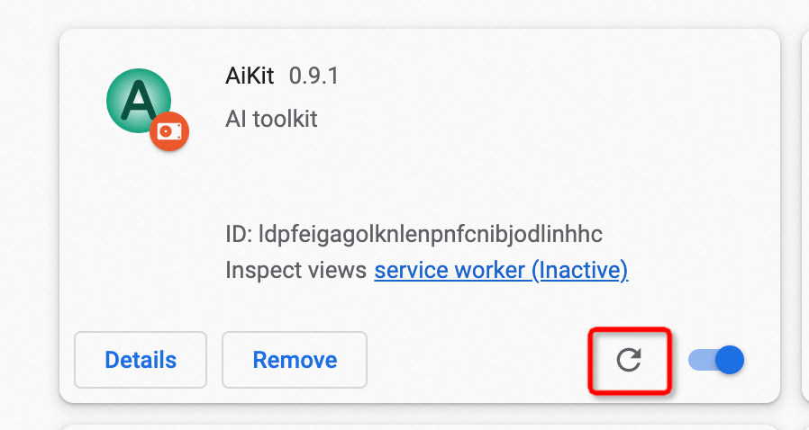

# 常见问题解决办法

## 如何打开浏览器插件管理页面

- Chrome浏览器 chrome://extensions
- Edge浏览器 edge//extensions

## 如何更新安装包
1. 将新下载的安装包，解压的原来的目录，进行替换；
2. 打开浏览器插件管理页面，以Chrome示意，点击刷按钮；
3. 注：更新完后，如遇页面无法正常唤起AiKit窗口，请先刷新下页面，浏览器机制导致；

