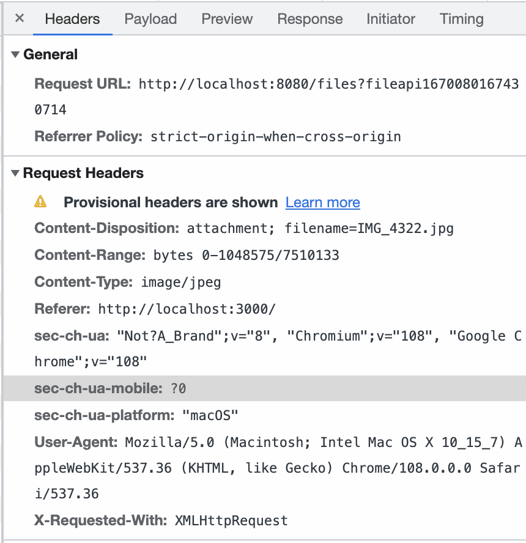
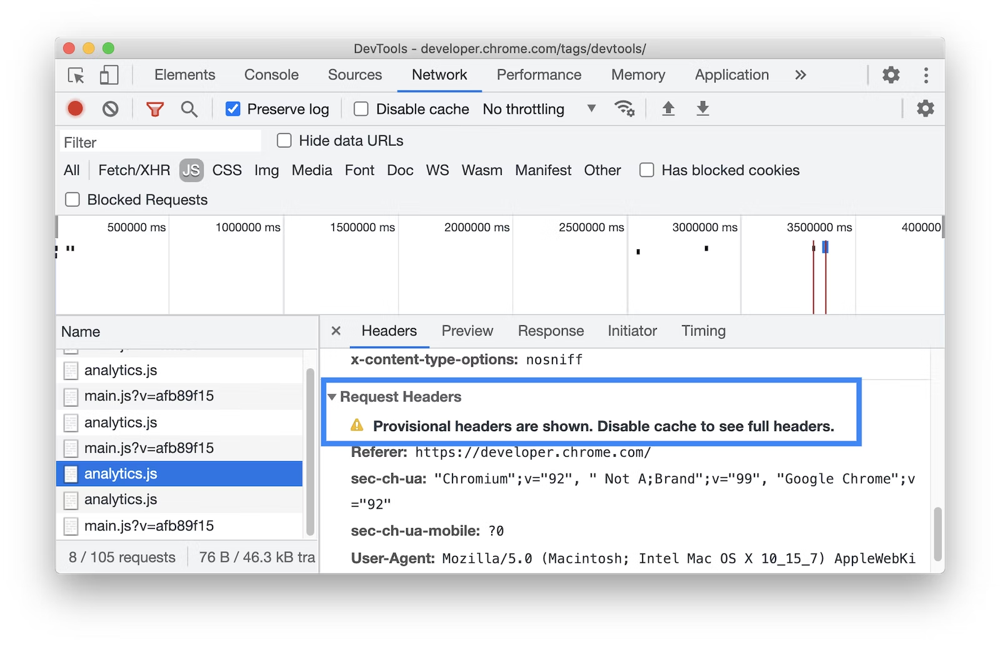
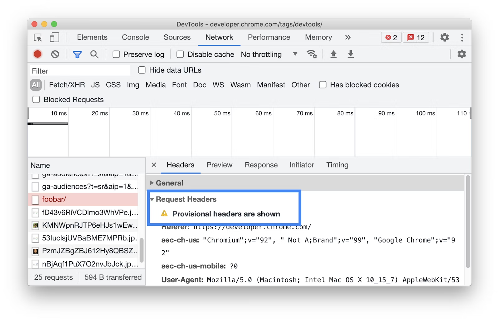
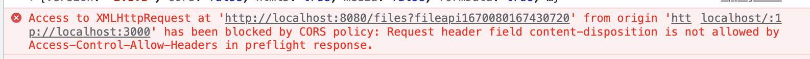
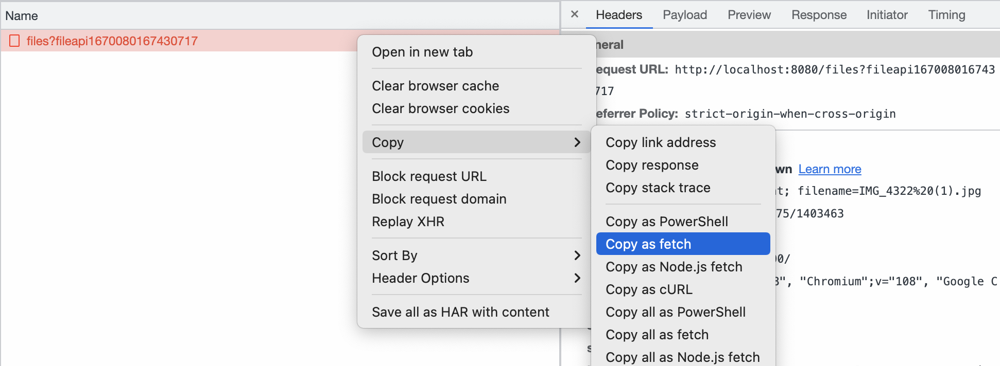
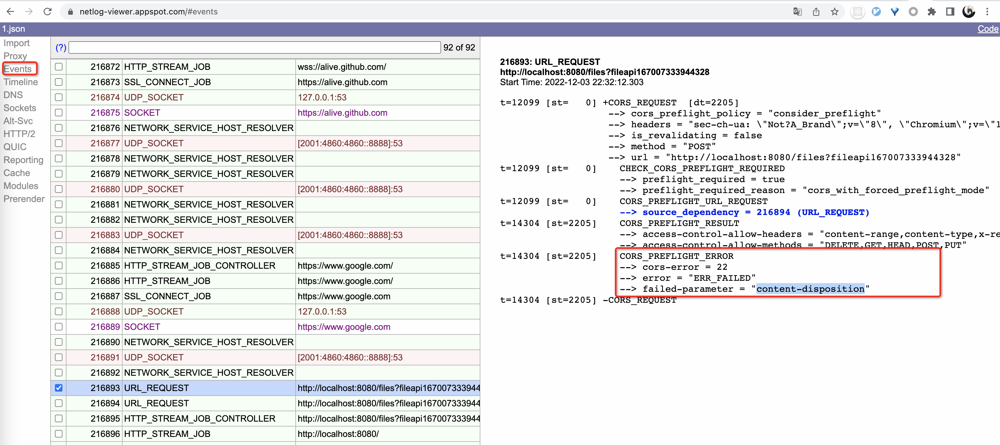

# CORS问题之“Provisional headers are shown”
## 背景

在开发网站的过程中，使用了前后端分离的架构，前后端分别有自己的服务容器，因此就存在跨域问题，因此后端开启了CORS处理。但是在前端在从浏览器发起请求时，浏览器提示 `Provisional headers are shown` ，如下图所示：



## 解读官方文档

根据 [Chrome Developer 官方文档](https://developer.chrome.com/docs/devtools/network/reference/?utm_source=devtools#provisional-headers)说明，可能存在以下一些原因：

- 请求未通过网络发送，但是被本地缓存处理，该请求未存储原始请求头。这种情况，你能通过[禁用缓存](https://developer.chrome.com/docs/devtools/network/reference/?utm_source=devtools#disable-cache)来查看完整的请求头。



- 网络资源不合法，例如在控制台执行 `fetch("``[https://jec.fyi.com/unknown-url/](https://jec.fyi.com/unknown-url/)``")` 。



开发者工具因为安全原因，只能展示浏览器策略允许的请求头字段。（DevTools can also display only provisional headers due to security reasons.）

<br/>

## 问题分析

分析官方的说明，我们可以了解到如果跨域请求时，如果请求头中存在服务端不允许的字段，浏览器就会拒绝服务，不发送请求。但问题来了，浏览器未告知哪些请求头字段是不被服务端允许的。接下来，我们将讲解如何找出这些字段。

<br/>

## 问题排查

### 方法一：查看控制台



### 方法二：通过拷贝原始请求信息，获取当时发送的请求头

如下图所示：



<br/>

<br/>

**延伸阅读**：简单请求不会触发CORS preflight (即OPTIONS请求)，简单请求在[Fetch Spec规范](https://fetch.spec.whatwg.org/#cors-safelisted-request-header)中有提到， `accept`  `accept-language`  `content-language`  `content-type`  `range`  字段在满足条件的情况下，是官方定义的，安全的，不被拦截的，不在清单中的请求头字段都可能要在服务端做额外的接收声明(即`Access-Control-Request-Headers`)。另外，这几个请求头也是[CORS规范](https://www.w3.org/TR/2014/REC-cors-20140116/#simple-header)定义的 `Simple Header` 。

<br/>

### 方法三：通过Chrome做网络日志工具，排查

新版的浏览器方法：

- 地址栏访问 `chrome://net-export` 

- 记录日志并指定日志文件位置

- 打开问题页面，操作页面功能进行复现

- 回到日志记录工具，停止记录

- 通过Chrome自带日志查看器查看日志文件，官方链接: [https://netlog-viewer.appspot.com/#import](https://netlog-viewer.appspot.com/#import)

- 点击事件(events)，查看与你相关请求事件，点击查看明细，示意图如下：



老版的浏览器方法：

- 地址栏访问 `chrome://net-internals` 

- 打开问题页面，操作页面功能进行复现

- 返回 net-internals, 点击事件(events)，查看与你相关请求事件，点击查看明细

<br/>

## 解决问题

根据规范说明，后端服务可以针对 CORS preflight请求(即OPTIONS请求)做出相应，以指定额外允许的请求头，Java代码实现如下：


```java
@Component
public class WebConfig implements WebMvcConfigurer {
    @Bean
    public FilterRegistrationBean<CorsFilter> corsFilter() {
        UrlBasedCorsConfigurationSource source = new UrlBasedCorsConfigurationSource();
        CorsConfiguration config = new CorsConfiguration();
        // 允许可跨域访问的Origins
        config.setAllowedOrigins(newArrayList(
            "http://127.0.0.1:3000",
            "http://localhost:3000"
        ));
        // 允许跨域访问的HTTP METHODS
        config.setAllowedMethods(newArrayList("POST", "GET", "DELETE", "PUT", "HEAD"));
        // 允许实际跨域请求额外可传递的请求头
        config.setAllowedHeaders(newArrayList(
            "Content-Type",
            "Content-Range",
            "X-Requested-With",
            "Content-Disposition"));
        // 允许实际跨域请求可以携带credentials，代表服务器通知客户端发送Cookie或HTTP Authentication等验权信息
        config.setAllowCredentials(true);
        config.setMaxAge(3600L);
        source.registerCorsConfiguration("/**", config);
        FilterRegistrationBean<CorsFilter> bean = new FilterRegistrationBean<>(new CorsFilter(source));
        bean.setOrder(0);
        return bean;
    }
}
```

<br/>

参考文档：

- [https://developer.mozilla.org/en-US/docs/Web/HTTP/CORS](https://developer.mozilla.org/en-US/docs/Web/HTTP/CORS)

- [https://fetch.spec.whatwg.org/#cors-safelisted-request-header](https://fetch.spec.whatwg.org/#cors-safelisted-request-header)

- [https://www.w3.org/TR/2014/REC-cors-20140116/](https://www.w3.org/TR/2014/REC-cors-20140116/#simple-header)

<br/>

