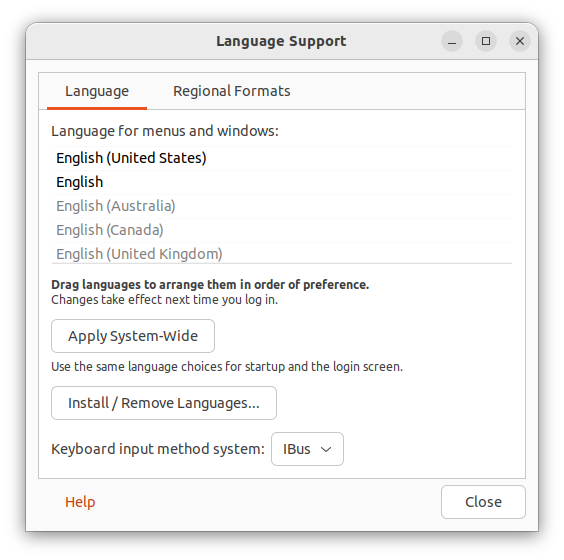
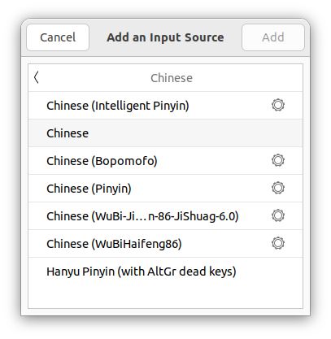

# Ubuntu中文输入法

## 添加语言支持

`Language Support`中的 `Install / Remove Languages…` 中安装汉语



## 切换IBus框架


```shell
im-config -s ibus
```

## 安装拼音引擎


```shell
sudo apt-get install ibus-pinyin
```

## 添加中文输入法

Keyboard > Input Sources

添加 Chinese(Intelligent Pinyin)

> 注：修改完毕之后，需要重启机器



## 输入法切换快捷键

输入法切换: `Win` + `空格`
中英文切换: `Shift`
