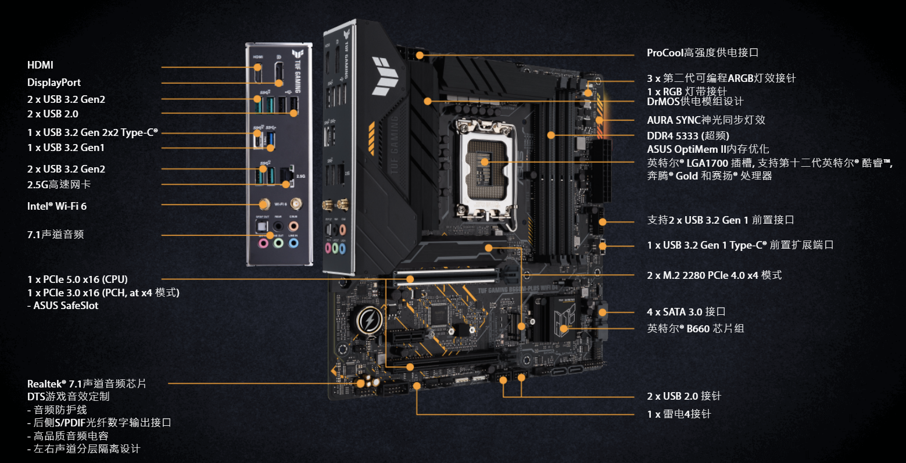
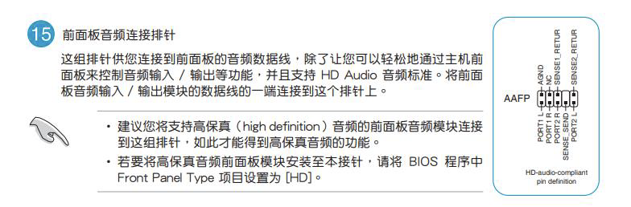
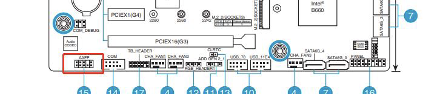

# 华硕B660M-PLUS装机小计

# 硬件清单

| 名称                                                  | 价格    | 备注         |
|-----------------------------------------------------|-------|------------|
| 航嘉（Huntkey）GS500C黑色                                 | 	116  | 支持ATX      |
| 九州风神（DEEPCOOL)玄冰400 EX CPU风冷	                       | 129   | 风扇可拆卸      |
| 西部数据固态硬盘 SN770 NVMe PCIe 4.0 升级版	                   | 459   |            |
| 美商海盗船（USCORSAIR）16GB DDR4 3600 复仇者LPX系列	            | 569   | 单条         |
| 希捷(Seagate)2TB 256MB 7200RPM  SATA接口 希捷酷鱼BarraCuda	 | 386   |            |
| 海韵 (SEASONIC)游戏酷核CORE GC550电源 550W (80PLUS金牌直出)	    | 539   |            |
| 华硕（ASUS）TUF GAMING B660M-PLUS WIFI D4重炮手主板	         | 1199  |            |
| 英特尔（Intel）第12代酷睿 i5-12400 CPU处理器6核12线程	             | 1489  |            |
| 戴尔 U2417 24寸	                                       | 1689  | 购自2016年11月 |

总计：4884元（不含DELL显示器）

# 装机小计

### 主板

主板上的CPU、内存、PCIe接口、USB3.0、供电接口都有防呆功能。按顺序接口就不会有问题。

我的接入顺序为：

1. CPU
2. 扇热器
3. 内存
4. 固态硬盘
5. 将主板安装到机箱
6. 将电源安装到机箱
7. 接上机箱跳线
8. 接上电源线
9. 整理排线

### 散热器

Intel自带有个扇热器，听网友说散热性能交叉，因此没有使用。

九州风神400EX两侧的风扇可以拆卸，金属挂钩轻轻一扣就出来了。在插CPU供电接口时，机箱内空间不够，不好插，需要把风扇拆卸下来。

两个风扇意味着需要插两个电源线，B660M-PLUS正好有，排在一起的。

### 电源

电源安装在机箱后下放，Logo文字朝上，接电插口对外即可。

海韵电源是两个4pin、一个6pin、一个2pin、一个主板供电接口，主板CPU供电口是8pin，没有单8pin，处理办法是两个4pin插到CPU供电口；另外
6pin + 2pin 是用于显卡供电的。

### 固态硬盘

固态硬盘我刚开始以为要用螺丝固定，后来发现该主板使用塑料活动扣上的，转动一下塑料扣即可。

### 机械硬盘

机械硬盘SATA接口本身不供电需要，在电源中找根供电接口接上。

机械硬盘需要拧6个螺丝，但有3个螺丝扣被机箱前板挡住，需要拆卸机箱前盖，如何拆卸见下文。

### 机箱

机箱前置音频接口 HD AUDIO 接口，需要插在主板的AAFP排针上，另外需要在BIOS中的Front Panel Type项目设置为HD。

如何拆卸前盖板：在前板底部能着手的地方，轻轻往斜上方一拉即可拆卸前板；

### 显示器

显示器有DP接口、miniDP接口、HDMI接口、几个USB3.0接口，另外附赠两根线，一根是DP转miniDP，一根是USB3.0方口（上行口）转USB3.0。

显示器的USB接口相当于扩展坞，没有视频传输能力，使用方式是，USB方口连接主机USB口，显示器上的USB3.0
口就能作为扩展接口，可以插U盘等外设，为机箱放在地面不利于插USB外设的场景提供了方便。

另外：原来DP转miniDP线是用于mac笔记本链接外接显示器的，线的DP口插在显示器上，miniDP插在mac上；新装机，机箱上没有miniDP接口，以为要买一根DP线（两头都是DP接口），但想到显示器上有miniDP接口，灵机一动DP转miniDP线是不是可以反过来用，DP头插在主机上，miniDP插到显示器上，经验证，此方式可行。

### WIFI

该主板带有WIFI功能，跟笔记本一样，装机后并不能直接连上无线网络，需要安装WIFI驱动，直接在官网下载。华硕主板售后支持官网是： [https://www.asus.com.cn/support](https://www.asus.com.cn/support)

我本来是下载了驱动精灵安装驱动的，但是驱动精灵非会员下载速度特别慢，于是去官网对照了下驱动版本，发现最新版本号一模一样，于是直接在官网下载并安装，解压包里有个AsusSetup.exe，双击执行并重启即可。
