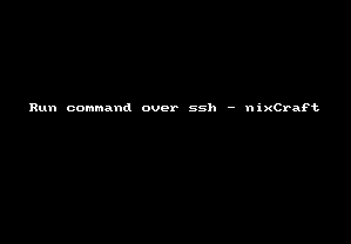
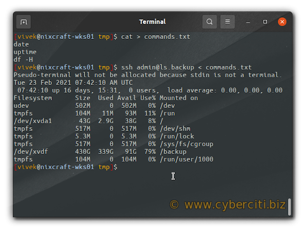
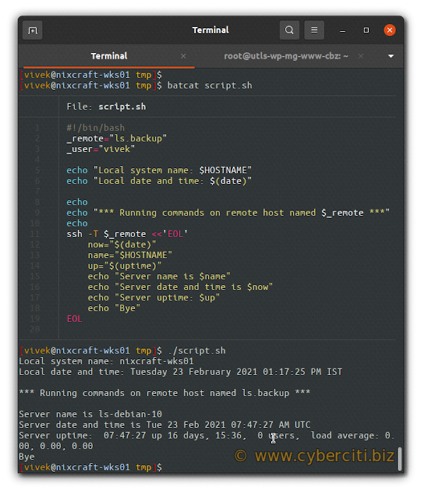

# 如何使用SSH远程执行命令

原文链接：[https://www.cyberciti.biz/faq/unix-linux-execute-command-using-ssh/](https://www.cyberciti.biz/faq/unix-linux-execute-command-using-ssh/)

<br/>

如何在UNIX、OSX、*BSD以及Linux操作系统下通过ssh远程执行命令？

<br/>

SSH客户端可以被用于远程登录机器，也可以远程执行命令。当ssh命令后面跟着其它命令，这时ssh会执行命令并返回，而不是登录到远程机器。接下来让我们来试下如何做到远程执行命令。

## SSH客户端执行命令的语法

语法如下：


```shell
ssh user1@server1 command1
ssh user1@server1 'command2'
# 使用管道 #
ssh user1@server1 'command1 | command2'
# 多个命令必须用双引号包起来 #
ssh admin@box1 "command1; command2; command3"
```

如上第一行代码，SSH客户端将使用**user1**账号登录到**server1**这台机器，并且运行**command1**命令。

<br/>

## SSH客户端远程执行命令的示例

### **获取服务器时间**


```shell
ssh user1@server1 date
```

### **查询服务器磁盘使用情况**


```shell
ssh user1@server1 'df -H'
```

### **查询服务器内核版本及Linux发行名称**


```shell
ssh root@nas01 "uname -mrs"
# or
ssh root@nas01 lsb_release -a
```



### 运行服务器上的脚本文件


```shell
ssh operator@oracle1  '/scripts/backup.sh'
```

<br/>

### 执行sudo或su命令的语法


```shell
## sudo syntax ##
ssh -t user@hostname sudo command
ssh -t user@hostname 'sudo command1 arg1 arg2'
 
 
## su syntax ##
ssh user@nas01 su -c "/path/to/command1 arg1 arg2"
 
# RHEL/CentOS specific #
ssh user@nas01 su --session-command="/path/to/command1 arg1 arg2"
ssh vivek@nixcraft.home.server su --session-command="/sbin/service httpd restart"
```

<br/>

没有 `-t` 参数你将得到一个错误，请参阅 [sudo: Sorry, you must have a tty to run sudo on a Linux and Unix](https://www.cyberciti.biz/faq/linux-unix-bsd-sudo-sorry-you-must-haveattytorun/)。

## 执行多个ssh命令

首先，创建一个新文件 commands.txt


```shell
cat > commands.txt
```

添加文件内容如下：


```shell
date
uptime
df -H
```

接下来，通过commands.txt这个本地文件，使用ssh客户端远程执行命令。


```shell
ssh server_name < commands.txt
ssh user@server_name < commands.txt
ssh admin@ls.backup <commands.txt
```

执行效果如下：



## 如何在shell脚本中执行多个ssh远程命令

命令如下，更多内容请参考[Here document](https://bash.cyberciti.biz/guide/Here_documents)，这是bash提供的能力


```shell
#!/bin/bash
_remote="ls.backup"
_user="vivek"
 
echo "Local system name: $HOSTNAME"
echo "Local date and time: $(date)"
 
echo
echo "*** Running commands on remote host named $_remote ***"
echo
ssh -T $_remote <<'EOL'
	now="$(date)"
	name="$HOSTNAME"
	up="$(uptime)"
	echo "Server name is $name"
	echo "Server date and time is $now"
	echo "Server uptime: $up"
	echo "Bye"
EOL
```

执行效果如下：



使用bash的Heredoc能力执行多行命令

## 总结

使用SSH远程执行命令的各种方式

 | **场景** | **语法** | **示例** | 
 | ---- | ---- | ---- | 
 | 单一命令 | `ssh $user@$host command`  | `ssh admin@ec2-server uptime`  | 
 | 多个命令 | `ssh user@server "command1; command2; script1"`  | `ssh vivek@linode-server "ls /etc/resolv.conf; date"` | 
 | 运行本地文件中的命令 | `ssh user@hostname < file`  | `ssh vivek@ls.www-db-1 < cmds.txt` | 
 | Heredoc中需要用到变量的情况 | `ssh -T box1<<'EOL'` | `ssh -T vivek@server1<<'ENDSSH'
  var=$(date)
  echo "$var"
ENDSSH` | 

要注意的是，当你传 `-T` 参数给ssh时，你期望的是关闭分配伪终端，另一方面，你能传 `-t` 参数给ssh，强制分配伪终端，这样你就能够远程执行一些交互式的命令，比如sudo命令。可以指定多个 `-t` 参数强制分配tty，即使ssh没有本地tty。更多ssh的说明请参阅[官方文档](https://man.openbsd.org/ssh)或者通过 `man ssh` 阅读本机文件。

<br/>

