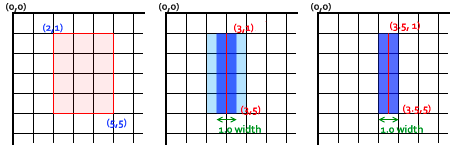

# 如何划出一条1像素的线

官方文档：

[https://developer.mozilla.org/en-US/docs/Web/API/Canvas_API/Tutorial/Applying_styles_and_colors#a_linewidth_example](https://developer.mozilla.org/en-US/docs/Web/API/Canvas_API/Tutorial/Applying_styles_and_colors#a_linewidth_example)

<br/>


```javascript
<div id="container" style="border: 1px solid #000000"></div>
<script>
  let container = document.getElementById('container');
  var canvas = document.createElement('canvas');
  canvas.style.width = '300px'
  canvas.style.height = '100px'
  canvas.width = 600
  canvas.height = 200
  container.appendChild(canvas);
  var ctx = canvas.getContext("2d");
  ctx.scale(2, 2);

  ctx.strokeStyle = "#000000";
  ctx.lineWidth = 1;
  ctx.moveTo(50, 10.5);
  ctx.lineTo(200, 10.5);
  ctx.stroke();

</script>
```

<br/>

线的渲染逻辑是，以指定的线，向外扩展指定的厚度，因此，1像素的线向外扩展会存在小数，在显示器上，最小单位是1像素，不能再拆分，因此为渲染成为两个像素厚度。

如下图官方文档所示：



<br/>

