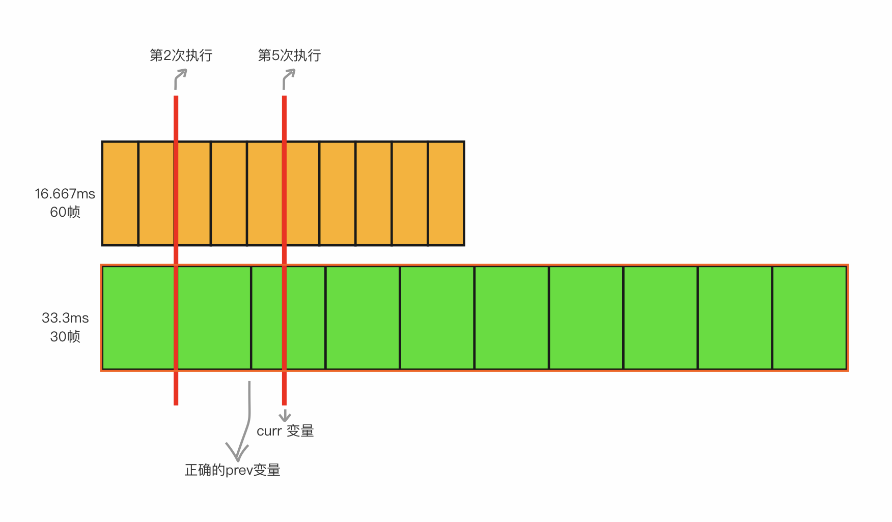

# 自定义控制网页渲染帧数

浏览器默认60帧调用requestAnimationFrame，一帧间隔16.667毫秒（1000毫秒 / 60帧），也就是说默认每16.667毫秒调用一次 requestAnimationFrame。若想改变网页渲染帧数（≤60），可以通过判断是否满足自己的设定的时间间隔，满足了才执行，下面是代码示例：


```javascript
var fps = 30;
var curr;
var prev = Date.now();
var interval = 1000/fps;
var delta;

function tick() {
　　requestAnimationFrame(tick);
　　curr = Date.now();
　　delta = curr - prev;
　　if (delta > interval) {
       // 这里需要抹去与默认帧间隔的时间差，如下图所示
　　　　prev = curr - (delta % interval);
　　　　draw(); // ... Code for Drawing the Frame ...
　　}
}
tick();
```



因此我们可以得出，自定义帧数并不能保证每一帧的间隔都是相同的。

<br/>

