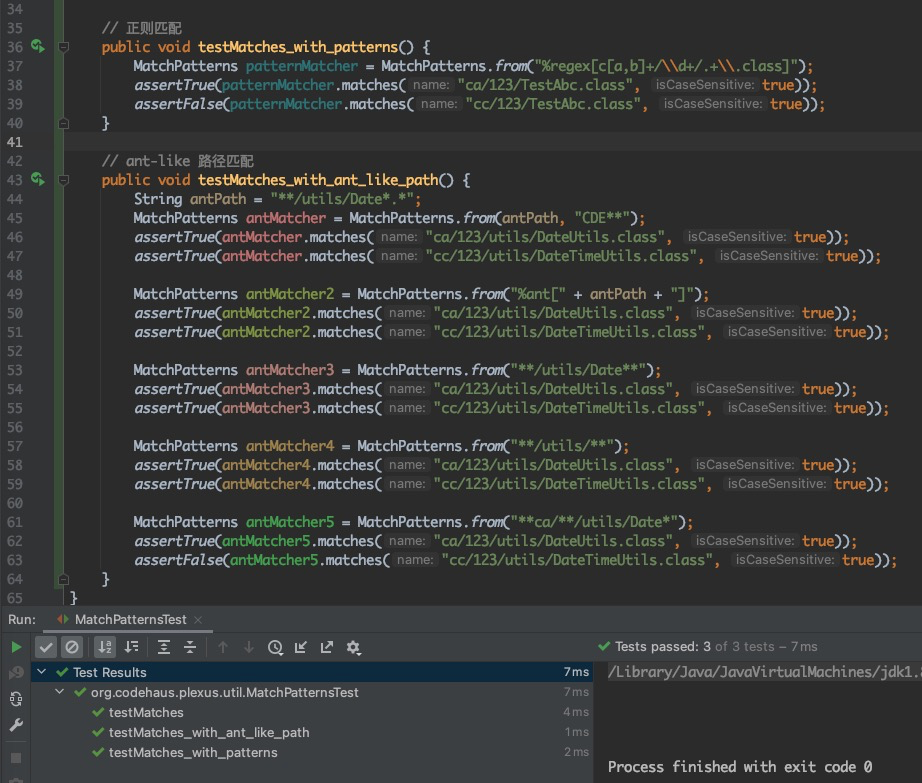

# Jacoco配置实践日志

## 集成 [Jacoco]
[Jacoco]是免费的、开源的代码覆盖率类库。以下实践会基于 Java + Maven3.0 + Jenkins 的环境实践。

## 导入Jacoco Maven插件

常用配置如下代码示例，最新版本新访问 [Maven Repository](https://mvnrepository.com/artifact/org.jacoco/jacoco-maven-plugin)。

```xml
<plugin>
    <groupId>org.jacoco</groupId>
    <artifactId>jacoco-maven-plugin</artifactId>
    <version>0.8.10</version>
    <executions>
        <execution>
            <id>default-prepare-agent</id>
            <goals>
                <goal>prepare-agent</goal>
            </goals>
        </execution>
        <execution>
            <id>default-report</id>
            <goals>
                <goal>report</goal>
            </goals>
        </execution>
        <execution>
            <id>default-check</id>
            <goals>
                <goal>check</goal>
            </goals>
        </execution>
    </executions>
</plugin>
```

## Jacoco插件Goals说明
[Goals说明官方链接](https://www.jacoco.org/jacoco/trunk/doc/maven.html)

一共有如下goals：help, prepare-agent, prepare-agent-integration, merge, report, report-integration, report-aggregate, check, dump, instrument, restore-instrumented-classes，

其中：

 - **prepare-agent** ：通过追加VM参数，给JVM runtime添加Jacoco agent，agent用户为每个class、method打点，并采集数据；此goal是Jacoco的基础设施，必须配置。该目标会生成Jacoco测试覆盖率采集的原始文件 jacoco.exec 。另外，该goal支持自定义参数配置，详见jacoco官网。
 - **report** ：该goal会读取 jacoco.exec ，并生成用户可读的文件，支持HTML、XML、CSV；支持自定义输出目录，也支持按 Maven Site Plugin 目录生成。
 - **check**：如字面意思，即是通过配置校验规则，校验代码覆盖率，校验失败时可终止maven构建周期（haltOnFailure）。规则配置详见下文。

## 项目中已存在VM参数，如何追加agent参数，使得Jacoco可用
上文我们讲过**prepare-agent的作用**，但如果你的项目中已存在为了执行测试的VM参数，必须确保Jacoco的参数能够追加到已有的VM参数，否则Jacoco将不生效。

其中一种方式是，在maven-surefire-plugin中增加[替换变量（late property evaluation）](https://maven.apache.org/surefire/maven-surefire-plugin/faq.html#late-property-evaluation)，代码如下所示，将Jacoco参数通过 `@{argLine}` 的方式追加：

```xml
<plugin>
  <groupId>org.apache.maven.plugins</groupId>
  <artifactId>maven-surefire-plugin</artifactId>
  <configuration>
    <argLine>@{argLine} -Dautoconfig.skip=true</argLine>
  </configuration>
</plugin>
```

另外，你可以清空maven-surefire-plugin配置，来避免找不到`@{argLine}` ，导致jacoco插件不执行问题。代码如下：

```xml
<properties>
  <argLine>-Dautoconfig.skip=true</argLine>
</properties>
...
<plugin>
  <groupId>org.apache.maven.plugins</groupId>
  <artifactId>maven-surefire-plugin</artifactId>
  <configuration>
    <!-- no argLine here -->
  </configuration>
</plugin>
```

## Maven Site插件
可以使用Maven Site插件，使得生产的代码覆盖率报告，自动集成到项目站点。

```xml
<plugin>
    <groupId>org.apache.maven.plugins</groupId>
    <artifactId>maven-site-plugin</artifactId>
    <version>3.7</version>
</plugin>
```

## 默认绑定的Maven生命周期
可以参考 [Maven生命周期官方文档](https://maven.apache.org/ref/3.8.2/maven-core/lifecycles.html) 查看各个goal执行顺序。

| Goal                         | 默认绑定的Maven生命周期        |
|:-----------------------------|:----------------------|
| prepare-agent                | initialize            |
| prepare-agent-integration    | pre-integration-test  |
| merge                        | generate-resources    |
| report                       | verify                |
| report-integration           | verify                |
| dump                         | post-integration-test |
| instrument                   | process-classes       |
| restore-instrumented-classes | prepare-package       |

## 校验规则配置
### 规则清单
详情请看[官方文档](https://www.jacoco.org/jacoco/trunk/doc/check-mojo.html#rules)

分组的规则为BUNDLE, PACKAGE, CLASS, SOURCEFILE or METHOD，分别表示：
 - BUNDLE：打包，所有目标整体计算校验；
 - PACKAGE：按java包校验；
 - CLASS：按类校验；
 - SOURCEFILE：按源文件校验；
 - METHOD：按方法校验；

分组中计数的规则分别为：
- INSTRUCTION：二进制代码指令
- LINE：行
- BRANCH：分支
- COMPLEXITY：圈复杂度
- METHOD：方法
- CLASS：类

计数器校验规则分别为：
- TOTALCOUNT：总数
- COVEREDCOUNT：覆盖数
- MISSEDCOUNT：缺失数
- COVEREDRATIO：覆盖率
- MISSEDRATIO：缺失率

每个计数校验规则都可以设置 minimum 或 maximum，其中比率可以通过0.0 - 1.0 的小数 或者 0% - 100% 百分比表示。

规则例子：
```xml
<rules>
  <rule>
    <element>BUNDLE</element>
    <limits>
      <limit implementation="org.jacoco.report.check.Limit">
        <counter>BRANCH</counter>
        <value>COVEREDRATIO</value>
        <minimum>0.60</minimum>
      </limit>
      <limit implementation="org.jacoco.report.check.Limit">
        <counter>LINE</counter>
        <value>COVEREDRATIO</value>
        <minimum>0.80</minimum>
      </limit>
      <limit implementation="org.jacoco.report.check.Limit">
        <counter>METHOD</counter>
        <value>COVEREDRATIO</value>
        <minimum>0.79</minimum>
      </limit>
      <limit implementation="org.jacoco.report.check.Limit">
        <counter>CLASS</counter>
        <value>COVEREDRATIO</value>
        <minimum>0.96</minimum>
      </limit>
    </limits>
  </rule>
</rules>
```

### 文件匹配规则

使用jacoco使用 ant-like 路径匹配、正则表达式匹配，底层使用 [plexus-utils] 工具类支持，check处理的目标目录 是 `${project.basedir}/target/classes` ，处理的文件是class字节文件。

下面是plexus-utils匹配规则的示例：


ant-like匹配规则，可以参考spring的[AntPathMatcher]。

### 单元、集成测试分离
```xml
<plugin>
    <groupId>org.apache.maven.plugins</groupId>
    <artifactId>maven-failsafe-plugin</artifactId>
    <version>3.0.0-M5</version>
    <configuration>
        <parallel>methods</parallel>
        <threadCount>10</threadCount>
    </configuration>
    <dependencies>
        <dependency>
            <groupId>org.apache.maven.surefire</groupId>
            <artifactId>surefire-junit47</artifactId>
            <version>3.0.0-M5</version>
        </dependency>
    </dependencies>
</plugin>
```

[Jacoco]: https://www.jacoco.org/jacoco/trunk/doc/ "Jacoco"
[plexus-utils]: https://github.com/codehaus-plexus/plexus-utils "plexus-utils"
[AntPathMatcher]: https://docs.spring.io/spring-framework/docs/current/javadoc-api/org/springframework/util/AntPathMatcher.html "AntPathMatcher" 
