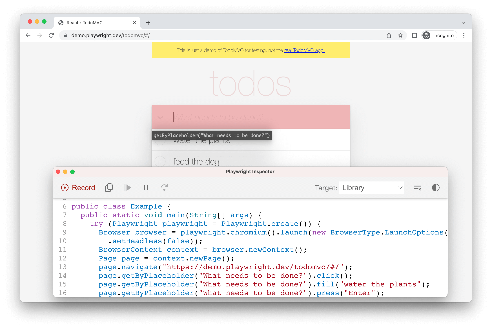

# Playwright使用引导

## 介绍
Playwright 是专门为满足端到端测试的需要而创建的。 Playwright 支持所有现代渲染引擎，包括 Chromium、WebKit 和 Firefox。 在 Windows、Linux 和 macOS 上，在本地或在 CI 上，在无头或有头的移动终端仿真进行测试。

到目前为止 Playwright 支持 Java、Node.js、Python、.NET四大主流语言，Java生态 Playwright 非常简洁的提供一个 [Maven](https://maven.apache.org/what-is-maven.html) 模块即可工作。 使用它的最简单方法是向项目的 pom.xml 添加一个依赖项，如下所述。 如果您不熟悉 Maven，请参阅其[文档](https://maven.apache.org/guides/getting-started/maven-in-five-minutes.html)。

### 使用

首先安装 Playwright 并运行示例文件以查看它的实际效果。

:::: code-group
::: code-group-item App.java
```java
// src/main/java/org/example/App.java
package org.example;

import com.microsoft.playwright.*;

public class App {
    public static void main(String[] args) {
        try (Playwright playwright = Playwright.create()) {
            Browser browser = playwright.chromium().launch();
            Page page = browser.newPage();
            page.navigate("https://cn.bing.com/?mkt=zh-CN");
            System.out.println(page.title());
        }
    }
}
```
:::
::: code-group-item pom.xml
```xml
<?xml version="1.0" encoding="UTF-8"?>
<project xmlns="http://maven.apache.org/POM/4.0.0" xmlns:xsi="http://www.w3.org/2001/XMLSchema-instance"
  xsi:schemaLocation="http://maven.apache.org/POM/4.0.0 http://maven.apache.org/xsd/maven-4.0.0.xsd">
  <modelVersion>4.0.0</modelVersion>

  <groupId>org.example</groupId>
  <artifactId>examples</artifactId>
  <version>0.1-SNAPSHOT</version>
  <name>Playwright Client Examples</name>
  <properties>
    <project.build.sourceEncoding>UTF-8</project.build.sourceEncoding>
  </properties>
  <dependencies>
    <dependency>
      <groupId>com.microsoft.playwright</groupId>
      <artifactId>playwright</artifactId>
      <version>1.32.0</version>
    </dependency>
  </dependencies>
  <build>
    <plugins>
      <plugin>
        <groupId>org.apache.maven.plugins</groupId>
        <artifactId>maven-compiler-plugin</artifactId>
        <version>3.10.1</version>
        <!-- References to interface static methods are allowed only at source level 1.8 or above -->
        <configuration>
          <source>1.8</source>
          <target>1.8</target>
        </configuration>
      </plugin>
    </plugins>
  </build>
</project>
```
:::
::::

使用上面的 App.java 和 pom.xml，编译并执行您的新程序，如下所示：
```sh
mvn compile exec:java -D exec.mainClass="org.example.App"
```
你也可以利用IDE的能力，直接运行main方法


## 编写测试
`Playwright` 测试可以通过多种方式进行。 我们建议将它用到您最喜欢的测试框架中，例如 [JUnit](https://junit.org/)，因为它使您能够并行运行测试、运行单个测试等。

您可以运行单个测试、一组测试或所有测试。 测试可以在一个浏览器或多个浏览器上运行。 默认情况下，测试以无头方式（headless，即不唤起UI）运行，这意味着在运行测试时不会打开浏览器窗口，并且会在终端中看到结果。 如果您愿意，可以使用 `launch(new BrowserType.LaunchOptions().setHeadless(false))` 选项以UI模式运行测试。

在 JUnit 中，您可以在 `@BeforeAll` 方法中初始化 `Playwright` 和 [Browser](https://playwright.dev/java/docs/api/class-browser)，并在 `@AfterAll` 中销毁它们。 在下面的示例中，三个测试方法都使用相同的浏览器。 每个测试都使用自己的 [BrowserContext](https://playwright.dev/java/docs/api/class-browsercontext) 和 [Page](https://playwright.dev/java/docs/api/class-page)。

```java
package org.example;

import com.microsoft.playwright.Browser;
import com.microsoft.playwright.BrowserContext;
import com.microsoft.playwright.Page;
import com.microsoft.playwright.Playwright;
import org.junit.jupiter.api.*;

import static org.junit.jupiter.api.Assertions.assertEquals;
import static org.junit.jupiter.api.Assertions.assertTrue;

public class TestExample {
  // 所有测试用例共享
  static Playwright playwright;
  static Browser browser;

  // 每个测试用例都会创建新的 context 实例
  BrowserContext context;
  Page page;

  @BeforeAll
  static void launchBrowser() {
    playwright = Playwright.create();
    browser = playwright.chromium().launch();
  }

  @AfterAll
  static void closeBrowser() {
    playwright.close();
  }

  @BeforeEach
  void createContextAndPage() {
    context = browser.newContext();
    page = context.newPage();
  }

  @AfterEach
  void closeContext() {
    context.close();
  }

  @Test
  void shouldClickButton() {
    page.navigate("data:text/html,<script>var result;</script><button onclick='result=\"Clicked\"'>Go</button>");
    page.locator("button").click();
    assertEquals("Clicked", page.evaluate("result"));
  }

  @Test
  void shouldCheckTheBox() {
    page.setContent("<input id='checkbox' type='checkbox'></input>");
    page.locator("input").check();
    assertTrue((Boolean) page.evaluate("() => window['checkbox'].checked"));
  }
}
```

## 测试生成器
Playwright 具有开箱即用的生成测试的能力，是快速开始测试的好方法。 它将打开两个窗口，一个是浏览器窗口，您可以在其中与要测试的网站进行交互，另一个是 Playwright Inspector 窗口，您可以在其中记录测试、复制测试、清除测试以及更改测试语言。

### 运行Codegen命令
使用 `codegen` 命令运行测试生成器，后跟要为其生成测试的网站的 URL。 URL 是可选的，您始终可以在没有它的情况下运行命令，然后将 URL 直接添加到浏览器窗口中。

```shell
mvn exec:java -e -D exec.mainClass=com.microsoft.playwright.CLI -D exec.args="codegen demo.playwright.dev/todomvc"
```

### 如何录制测试
运行 `codegen` 并在浏览器中执行操作。 Playwright 将为用户交互生成代码。 `Codegen` 将查看页面并计算出推荐的定位器(locator)、优先级角色(AriaRole)、文本和 test-id 定位器。 如果生成器识别出与定位器匹配的多个元素，它将改进定位器，使其具有弹性并唯一标识目标元素，从而消除和减少由于定位器导致的测试失败和脆弱性。



### 生成定位器

您可以使用测试生成器生成[定位器](#locator)。

 - 按下 `Record` 按钮停止录音，`Pick Locator` 按钮将出现。
 - 单击该`Pick Locator`按钮，然后将鼠标悬停在浏览器窗口中的元素上，以查看每个元素下方突出显示的定位器。
 - 要选择定位器，请单击您要定位的元素，该定位器的代码将出现在“选择定位器”按钮旁边的字段中。
 - 然后，您可以在此字段中编辑定位器以对其进行微调，或使用复制按钮将其复制并粘贴到您的代码中。


## 操作
Playwright 可以与 HTML 输入元素交互，例如文本输入、复选框、单选按钮、选择选项、鼠标单击、键入字符、键和快捷方式以及上传文件和焦点元素。

### 输入框
使用 [Locator.fill()](https://playwright.dev/java/docs/api/class-locator#locator-fill) 是填写表单字段的最简单方法。 它聚焦元素并使用输入的文本触发输入事件。 它适用于 `<input>`、`<textarea>` 和 `[contenteditable]` 元素。

```java
// 文本输入框
page.getByRole(AriaRole.TEXTBOX).fill("Peter");

// 日期输入框
page.getByLabel("Birth date").fill("2020-02-02");

// 时间输入框
page.getByLabel("Appointment time").fill("13-15");

// 日期时间输入框
page.getByLabel("Local time").fill("2020-03-02T05:15");
```

### 复选框和单选按钮
使用 [Locator.setChecked()](https://playwright.dev/java/docs/api/class-locator#locator-set-checked) 是选中和取消选中复选框或单选按钮的最简单方法。 此方法可与 `input[type=checkbox]`、`input[type=radio]` 和 `[role=checkbox]` 元素一起使用。

```java
// 勾选复选框
page.getByLabel("I agree to the terms above").check();

// 断言勾选框是否已勾选
assertTrue(page.getByLabel("Subscribe to newsletter").isChecked());

// 勾选单选框
page.getByLabel("XL").check();
```

### 下拉框
使用 [Locator.selectOption()](https://playwright.dev/java/docs/api/class-locator#locator-select-option) 在 `<select>` 元素中选择一个或多个选项。 您可以指定选项`value`或`label`来选择。 可以选择多个选项。

```java
// 指定value选择
page.getByLabel("Choose a color").selectOption("blue");

// 指定label选择
page.getByLabel("Choose a color").selectOption(new SelectOption().setLabel("Blue"));

// 多选
page.getByLabel("Choose multiple colors").selectOption(new String[] {"red", "green", "blue"});
```
### 鼠标点击
执行简单的人工点击

```java
// 单击
page.getByRole(AriaRole.BUTTON).click();

// 双击
page.getByText("Item").dblclick();

// 鼠标右键
page.getByText("Item").click(new Locator.ClickOptions().setButton(MouseButton.RIGHT));

// Shift + 单击
page.getByText("Item").click(new Locator.ClickOptions().setModifiers(Arrays.asList(KeyboardModifier.SHIFT)));

// 鼠标悬浮
page.getByText("Item").hover();

// 元素左上角位置单击
page.getByText("Item").click(new Locator.ClickOptions().setPosition(0, 0));
```

以上方法以及其他与指针相关的方法，在幕后会：
 - 等待具有给定选择器的元素出现在 DOM 中
 - 等待它显示出来，即不为空，不是`display:none`，不是`visibility:hidden`
 - 等待它停止移动，例如，直到 css 转换完成
 - 将元素滚动到视图中
 - 等待它在动作点接收指针事件，例如，等待直到元素变得不被其他元素遮挡
 - 如果元素在上述任何检查期间分离，则重试

这些在幕后的等待过程，是Playwright提供强大的 [Auto-Waiting](#自动等待) 能力，大大简化了开发者的使用难度以及测试代码的整洁度。

## 自动等待
`Playwright` 在采取行动之前对元素执行一系列可操作性检查，以确保这些行动按预期进行。 它会自动等待所有相关检查通过，然后才执行请求的操作。 如果在给定的超时时间内未通过所需的检查，则操作失败并出现 `TimeoutError`。

例如，对于 [Page.click()](https://playwright.dev/java/docs/api/class-page#page-click)，Playwright 将确保：
 - 元素[被添加](#被添加)到DOM中
 - 元素[可见](#可见)
 - 元素是[稳定的](#稳定的), 即元素未正在运行动画，或动画已完成
 - 元素[能够接受事件](#能够接受事件),即元素未被其它元素遮盖
 - 元素[启用](#启用)，即`enabled`

**以下是为每个操作执行的可操作性检查的完整列表：**

| 操作 | [被添加] | [可见] | [稳定的] | [可接受事件] | [启用] | [可编辑] |
| :- | :-: | :-: | :-: | :-: | :-: | :-: |
| check | 是 | 是 | 是 | 是 | 是 | - |
| click | 是 | 是 | 是 | 是 | 是 | - |
| dblclick | 是 | 是 | 是 | 是 | 是 | - |
| setChecked | 是 | 是 | 是 | 是 | 是 | - |
| tap | 是 | 是 | 是 | 是 | 是 | - |
| uncheck | 是 | 是 | 是 | 是 | 是 | - |
| hover | 是 | 是 | 是 | 是 | - | - |
| scrollIntoViewIfNeeded | 是 | - | 是 | - | - | - |
| screenshot | 是 | 是 | 是 | - | - | - |
| fill | 是 | 是 | - | - | 是 | 是 |
| selectText | 是 | 是 | - | - | - | - |
| dispatchEvent | 是 | - | - | - | - | - |
| focus | 是 | - | - | - | - | - |
| getAttribute | 是 | - | - | - | - | - |
| innerText | 是 | - | - | - | - | - |
| innerHTML | 是 | - | - | - | - | - |
| press | 是 | - | - | - | - | - |
| setInputFiles | 是 | - | - | - | - | - |
| selectOption | 是 | 是 | - | - | 是 | - |
| textContent | 是 | - | - | - | - | - |
| type | 是 | - | - | - | - | - |

<br/>

### 强制操作
[Page.click()](https://playwright.dev/java/docs/api/class-page#page-click) 等某些操作支持禁用非必要可操作性检查的 `force` 选项，例如将 `force = true` 传递给 [Page.click()](https://playwright.dev/java/docs/api/class-page#page-click) 方法将不会检查目标元素是否实际接收到点击事件。

### 元素检查状态
您也可以使用以下方法之一检查元素的可操作性状态。 这通常不是必需的，但它有助于编写断言测试以确保在某些操作之后，元素达到可操作状态：

- [ElementHandle.isChecked()](https://playwright.dev/java/docs/api/class-elementhandle#element-handle-is-checked)
- [ElementHandle.isDisabled()](https://playwright.dev/java/docs/api/class-elementhandle#element-handle-is-disabled)
- [ElementHandle.isEditable()](https://playwright.dev/java/docs/api/class-elementhandle#element-handle-is-editable)
- [ElementHandle.isEnabled()](https://playwright.dev/java/docs/api/class-elementhandle#element-handle-is-enabled)
- [ElementHandle.isHidden()](https://playwright.dev/java/docs/api/class-elementhandle#element-handle-is-hidden)
- [ElementHandle.isVisible()](https://playwright.dev/java/docs/api/class-elementhandle#element-handle-is-visible)
- [Page.isChecked()](https://playwright.dev/java/docs/api/class-page#page-is-checked)
- [Page.isDisabled()](https://playwright.dev/java/docs/api/class-page#page-is-disabled)
- [Page.isEditable()](https://playwright.dev/java/docs/api/class-page#page-is-editable)
- [Page.isEnabled()](https://playwright.dev/java/docs/api/class-page#page-is-enabled)
- [Page.isHidden()](https://playwright.dev/java/docs/api/class-page#page-is-hidden)
- [Page.isVisible()](https://playwright.dev/java/docs/api/class-page#page-is-visible)
- [Locator.isChecked()](https://playwright.dev/java/docs/api/class-locator#locator-is-checked)
- [Locator.isDisabled()](https://playwright.dev/java/docs/api/class-locator#locator-is-disabled)
- [Locator.isEditable()](https://playwright.dev/java/docs/api/class-locator#locator-is-editable)
- [Locator.isEnabled()](https://playwright.dev/java/docs/api/class-locator#locator-is-enabled)
- [Locator.isHidden()](https://playwright.dev/java/docs/api/class-locator#locator-is-hidden)
- [Locator.isVisible()](https://playwright.dev/java/docs/api/class-locator#locator-is-visible)

### 被添加

当元素 [connected](https://developer.mozilla.org/en-US/docs/Web/API/Node/isConnected) 到 Document 或 ShadowRoot 时，元素被认为是附加的。

### 可见

当元素具有非空边界框并且没有 visibility:hidden 计算样式时，元素被认为是可见的。 请注意，零大小或带有“display:none”的元素不被视为可见。

### 稳定的

当元素在至少两个连续的动画帧中保持相同的边界框时，它被认为是稳定的。

## 启用

元素被认为是启用的，除非它是具有“禁用”属性的 `<button>`、`<select>`、`<input>`或`<textarea>`。

## 可编辑

元素在 [启用](#启用)中 且未设置 `readonly` 属性时被视为可编辑。

## 能够接受事件

当元素在动作点是指针事件的命中目标时，就认为它接收到指针事件。 例如，当单击“(10;10)”点时，Playwright 会检查其他元素（通常是覆盖层）是否会捕获“(10;10)”处的单击。

例如，考虑这样一个场景，无论何时进行 [Page.click()](https://playwright.dev/java/docs/api/class-page#page-click) 调用，Playwright 都会单击“注册”按钮：
- 页面正在检查用户名是否唯一，并且“注册”按钮已禁用；
- 与服务器核实后，禁用的“注册”按钮被替换为另一个现在启用的按钮。

## 断言

| 断言方法 | 说明 |
| :- | :- |
|assertThat(locator).isChecked() |	是否勾选 |
|assertThat(locator).isDisabled() |	是否失效 |
|assertThat(locator).isEditable() |	是否可编辑 |
|assertThat(locator).isEmpty() | 元素是否为空容器 |
|assertThat(locator).isEnabled() |	是否启用 |
|assertThat(locator).isFocused() |	是否聚焦 |
|assertThat(locator).isHidden() |	是否不可见 |
|assertThat(locator).isVisible() |	是否可见 |
|assertThat(locator).containsText() |	是否包含文本 |
|assertThat(locator).hasAttribute() |	是否含有某个DOM属性 |
|assertThat(locator).hasClass() |	是否含有每个className |
|assertThat(locator).hasCount() |	定位元素的个数 |
|assertThat(locator).hasCSS() |	是否含有某个CSS属性 |
|assertThat(locator).hasId() |	时候有ID |
|assertThat(locator).hasJSProperty() |	是否有JS属性 |
|assertThat(locator).hasText() |	是否全部包含文本 |
|assertThat(locator).hasValue() |	表单是否有某个值 |
|assertThat(locator).hasValues() |	下拉框选择值是否匹配 |
|assertThat(page).hasTitle() |	页面标题是否匹配 |
|assertThat(page).hasURL() |	页面URL是否匹配 |
|assertThat(apiResponse).isOK() |	API响应状态是否OK |

## Locator
定位器（Locator）是 Playwright 自动等待和重试能力的核心部分。 简而言之，定位器代表了一种随时在页面上查找元素的方法。

内建的定位器方法如下所示：
 - [Page.getByRole()](https://playwright.dev/java/docs/locators#locate-by-role) 用于通过显示或隐式的AriaRole定位元素
 - [Page.getByText()](https://playwright.dev/java/docs/locators#locate-by-text) 用于通过文本定位元素
 - [Page.getByLabel()](https://playwright.dev/java/docs/locators#locate-by-label) 用于通过表单控制器或label标签文本定位元素
 - [Page.getByPlaceholder()](https://playwright.dev/java/docs/locators#locate-by-placeholder) 用于通过placeholder属性定位元素
 - [Page.getByAltText()](https://playwright.dev/java/docs/locators#locate-by-alt-text) 用于通过alt文本定位元素, 通常用于定位image元素
 - [Page.getByTitle()](https://playwright.dev/java/docs/locators#locate-by-title) 用于通过title文本定位元素
 - [Page.getByTestId()](https://playwright.dev/java/docs/locators#locate-by-test-id) 用于通过data-testid属性定位元素

```java
page.getByLabel("User Name").fill("John");

page.getByLabel("Password").fill("secret-password");

page.getByRole(AriaRole.BUTTON, new Page.GetByRoleOptions().setName("Sign in"))
    .click();

assertThat(page.getByText("Welcome, John!")).isVisible();
```

## Handles
Playwright 可以创建页面 DOM 元素或页面内任何其他对象的句柄。 这些句柄存在于 Playwright 进程中，而实际对象存在于浏览器中。 有两种类型的句柄：

- [JSHandle] 引用页面中的任何 JavaScript 对象
- [ElementHandle] 引用页面中的 DOM 元素，它有额外的方法允许对元素执行操作并断言它们的属性。

由于页面中的任何 DOM 元素也是一个 JavaScript 对象，因此任何 [ElementHandle] 也是一个 [JSHandle]。

句柄用于对页面中的那些实际对象执行操作。 您可以评估句柄、获取句柄属性、将句柄作为评估参数传递、将页面对象序列化为 JSON 等。有关这些和方法，请参阅 [JSHandle] 类 API。

### JS句柄
```java
JSHandle jsHandle = page.evaluateHandle("window");
//  使用jsHandle进行计算...
```

### 元素句柄
::: danger
不鼓励使用 [ElementHandle]，而是使用 [Locator] 对象和网络优先断言。
:::

当需要 [ElementHandle] 时，建议使用 [Page.waitForSelector()](https://playwright.dev/java/docs/api/class-page#page-wait-for-selector) 或 [Frame.waitForSelector()](https://playwright.dev/java/docs/api/class-frame#frame-wait-for-selector) 方法获取它。 这些 API 等待元素[被添加]和[可见]。

```java
// Get the element handle
JSHandle jsHandle = page.waitForSelector("#box");
ElementHandle elementHandle = jsHandle.asElement();

// Assert bounding box for the element
BoundingBox boundingBox = elementHandle.boundingBox();
assertEquals(100, boundingBox.width);

// Assert attribute for the element
String classNames = elementHandle.getAttribute("class");
assertTrue(classNames.contains("highlighted"));
```

### ElementHandle 与 Locator 的区别
::: danger
我们只建议在需要在静态页面上执行大量 DOM 遍历的极少数情况下使用 [ElementHandle]。 对于所有用户操作和断言，请改用[Locator]。
:::

[Locator] 和 [ElementHandle] 之间的区别在于后者指向特定元素，而 [Locator] 捕获如何检索该元素的逻辑。

在下面的示例中，句柄指向页面上的特定 DOM 元素。 如果那个元素改变了文本或者被 React 用来渲染一个完全不同的组件，句柄仍然指向那个非常陈旧的 DOM 元素。 这可能会导致意外行为。

```java
ElementHandle handle = page.querySelector("text=Submit");
handle.hover();
handle.click();
```

使用定位器，每次使用定位器时，都会使用选择器在页面中定位最新的 DOM 元素。 所以在下面的代码片段中，底层 DOM 元素将被定位两次。

```java
Locator locator = page.getByText("Submit");
locator.hover();
locator.click();
```

## Frames（支持iframe测试）
一页可以附加一个或多个iframe对象。 每个页面都有一个主框架(当前页)，并且假定页面级交互（如点击）在主框架中运行。

一个页面可以有附加的带有 iframe HTML 标签的框架。 可以访问这些iframe以在iframe内进行交互。

```java
// iframe内定位元素
Locator username = page.frameLocator(".frame-class").getByLabel("User Name");
username.fill("John");
```

### frame对象
可以使用 [Page.frame()](https://playwright.dev/java/docs/api/class-page#page-frame) API 访问框架对象：

```java
// 通过iframe的name属性获取frame对象
Frame frame = page.frame("frame-login");

// 通过iframe的url匹配获取frame对象
Frame frame = page.frameByUrl(Pattern.compile(".*domain.*"));

// 在iframe对象中操作
frame.fill("#username-input", "John");
```

[JSHandle]: https://playwright.dev/java/docs/api/class-jshandle "JSHandle" 
[ElementHandle]: https://playwright.dev/java/docs/api/class-elementhandle "ElementHandle"
[被附加]: #被添加 "被添加"
[可见]: #可见 '可见'
[Locator]: #locator "Locator"

## 总结
初步学习 Playwright 要了解它的 自动等待、定位器、句柄、内建断言，要了解定位器以及句柄的差异，避免在使用中踩坑，感谢您的收看，另外我们还提供了以下关于Playwright的文章，欢迎阅读

 - [Java中使用Playwright实现端到端测试](./playwright-e2e-testing-in-java.md)
